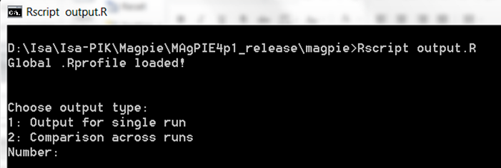
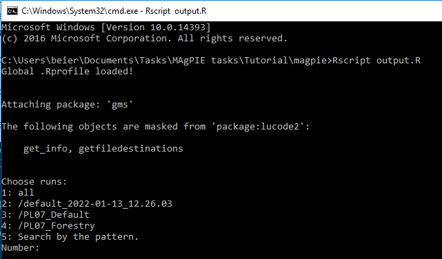
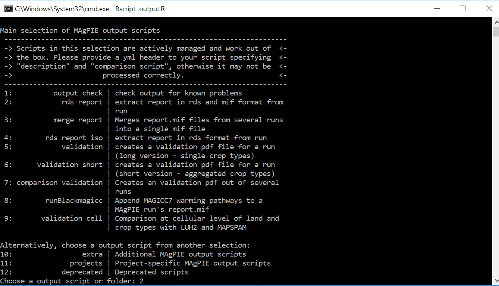
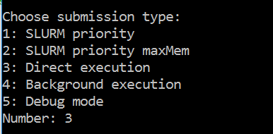
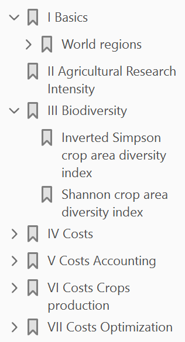
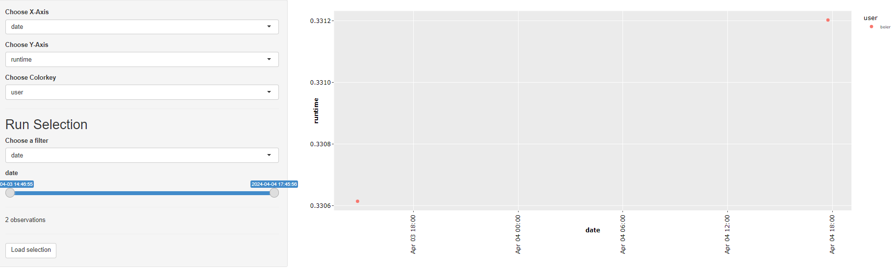
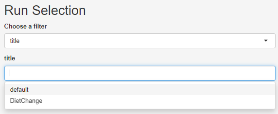
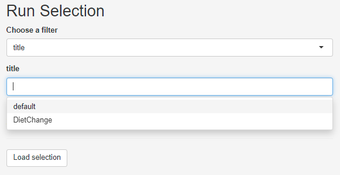
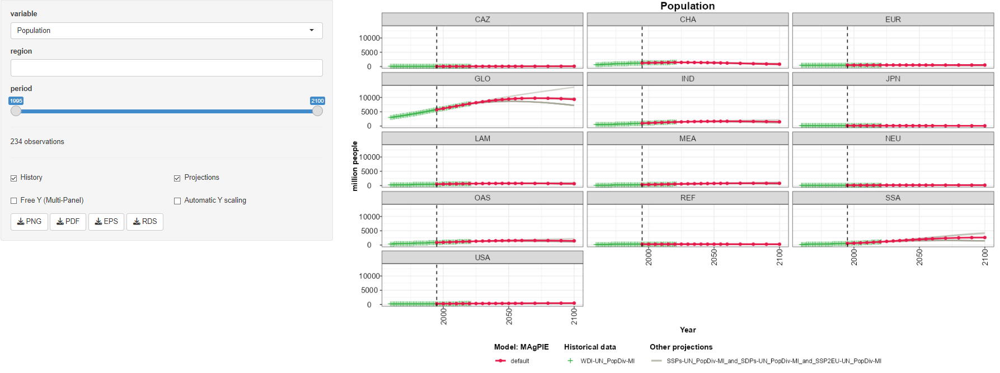
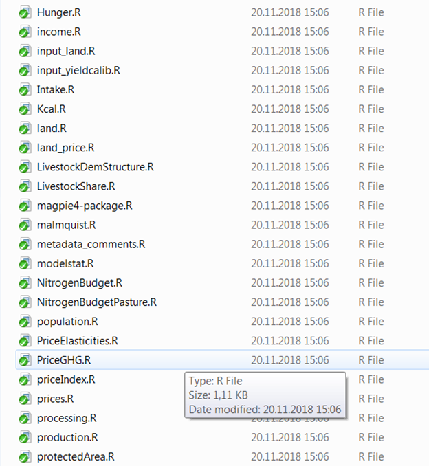

## Introduction

After having successfully started and accomplished a simulation run, the
next step is to evaluate the simulation results. In case you have not
yet conducted an own MAgPIE simulation or your simulation is still
running, you can download model runs produced with the master branch of
the GIT repository (<https://github.com/magpiemodel/magpie/tree/master>)
for the MAgPIE4 release and copy the folders containing the simulation
results into the **output** folder of your local version of the MAgPIE
model. The runs can be downloaded from:
<https://zenodo.org/record/2572620#.X8Zr9RbPw2w>. They have been release
together with the MAgPIE4 model description paper
(<https://gmd.copernicus.org/articles/12/1299/2019/gmd-12-1299-2019-assets.html>).

There are several ways to assess and evaluate MAgPIE results. This
tutorial gives an overview on different tools and options that can be
used to analyse model outputs.

For each simulation, results are written to a folder that is created
automatically as a combination of the **model title** and other
information (as defined in the default.cfg via the command
cfg$results\_folder) inside the **output** folder of the model.

## Model-internal R-scripts for output analysis

In the file “config/default.cfg”, it is possible to indicate which
R-scripts are executed for output analysis after a model run is
finished. Scripts evaluating single runs are stored in the folder
**scripts/output/single**, while the folder
**scripts/output/comparison** contains scripts that compare model output
across several runs. In the default MAgPIE configuration, the scripts
*rds\_report* (to be used in appResultsLocal; see explanations below),
*validation* and *interpolation* are selected via cfg$output:

``` r
cfg$output <- c("rds_report","validation","interpolation")
```

Output scripts that are included in the folders
**scripts/output/single** and **scripts/output/comparison** can also be
executed via command window. To do so, windows users can open a command
line prompt in the MAgPIE model folder by using **shift** + **right
click** and then selecting *open command window here* option.

In the command prompt, use the following command:

``` r
Rscript output.R
```

You are now asked to choose the output mode: 1: Output for single run 2:
Comparison across
runs



In both cases, you can choose from the list of available model
simulations, for which runs you want to conduct the model output
analysis:



In the next step, you can interactively indicate which model-internal
output scripts you want to
execute:



The last step is to select the run submission type, e.g.“Direct
execution”:



Now, the selected script is executed. After completion, the results are
written in the respective folder of the simulation run inside the
**output** folder of the model.

### Exercise

Execute the model-internal output script **report.R** via command
window. This script collects the results of several report-functions -
that calculate many key output variables like Production, Land Use or
Yields - and writes them into one mif-file that can be read with text
editors. Please refer to the `vignette("mif")` of the package *mip*
(model intercomparison plots) to learn more about the mif format.

## Automated model validation

The automated model validation is an important example of output
analysis based on model-internal scripts (see section 2). If the
validation script is executed (either by selection via cfg$output as
explained in 2.1. or by execution via the command window as explained in
2.2.), a standard evaluation PDF is created that validates numerous
model outputs with a validation database containing historical data and
projections for most outputs returned by the model, either visually or
via statistical tests. A standard evaluation PDF consists of hundreds of
evaluation outputs and usually has a length of around 1800 pages. By
evaluating the model outputs on such a broad level rather than focusing
only on key outputs, it allows getting a more complete picture of the
corresponding simulation. As an example of such validation files, you
can download the evaluation documents produced for all runs shown in the
MAgPIE 4 framework paper (<https://doi.org/10.5281/zenodo.1485303>).

The table of contents of the validation PDF gives a good overview over
the model outputs that can be simulated with a MAgPIE standard
simulation, even though the validation PDF only shows a subset of
possible model
outputs:



### Exercise

Open a validation pdf (either in a folder containing your own simulation
results or the downloaded MAgPIE simulation runs, or the validation
files that show results of the simulation runs used for the MAgPIE4
paper) and

1.  make yourself familiar with the structure of the document and the
    hierarchy of outputs as displayed by the table of contents and
2.  have a look at some figures displaying model outputs of your
    interest.

## Interactive scenario analysis

The automated model validation PDF is a good tool for visually
evaluating a broad range of model outputs. However, comparison between
model runs, i.e. between different scenarios, is rather difficult and
inconvenient with the different model results being scattered across
different large PDF files.

To overcome this issue, we developed the interactive scenario analysis
and evaluation tools appResultsLocal (and appResults for the use within
the PIK network) as part of the library **shinyresults**
(<https://github.com/pik-piam/shinyresults>), which show evaluation
plots for multiple scenarios including historical data and other
projections based on an interactive selection of regions and variables.
You can use this tool by running the following R command in the main
folder of your model, which will automatically collect all runs in the
output folder and visualize them:

``` r
shinyresults::appResultsLocal()
```

This command opens an interactive window, where you can select the
simulations that you want to
evaluate.



You can use filters to select a subset of all runs stored in the output
folder of the model, for example by searching for runs that have been
finished at a certain day or by searching for keywords in the title of
the simulation
runs:



### Exercise

Choose *title* as filter and select 2 simulations that are stored in the
output folder of your model, e.g. the SSP2 and SSP5 simulations from the
downloaded set of MAgPIE
runs:



After having selected the subset of runs that you want to analyse, click
the button *Load selection*. Now, you can click on the tab *LinePLot*.
You will then see on the right hand side line plots showing the
development of population for historical and future time steps for all
model regions and on the global
scale:



Now, choose a variable of your interest, either by scrolling through the
drop-down menu or write a key word in the input field, e.g. “cropland”,
to reduce the options in the
menu.


Make yourself familiar with the features of the app\! You can, for
example, select a subset of regions or a subset of time steps for which
the results should be plotted. Moreover, you can free the y-axis,
include or exclude validation data (if available) and download the plot.

## Analysis of outputs with the magpie4 library

If you want to go beyond visual output analysis and predefined output
evaluation facilitated by scripts in the model folders
**scripts/output/single** and **scripts/output/comparison**, you can use
the functionality of the R package *magpie4*
(<https://github.com/pik-piam/magpie4>). This library contains a list of
common functions for extracting outputs from the MAgPIE model which are
also the basis for the generation of the automated validation PDF. For a
quick overview on the functions which are included in the library, you
can have a look in the folder **magpie4/R**. The following figure shows
a subset of R-files included in
**magpie4/R**:



For making yourself familiar with this library, you can open a R/RStudio
session and set the MAgPIE model folder as working directory. This can
be done by using the following command:

``` r
setwd("/path/to/your/magpie/model/folder")
```

Then, load the library and call the help pages:

``` r
library(magpie4)
?magpie4
```

You can click on the index and search for interesting functions, e.g.
**carbonstock**, and read the respective help
page:


### Exercise

Apply the function *carbonstock* for calculations in R, by using the
file “fulldata.gdx” in the folder of a model simulation run as input for
the function.

1.  Use the default settings of the arguments of the function
2.  Change the arguments of the function, e.g. set the level from “cell”
    to “reg”.

## Analysis of outputs with the gdx library

The **gdx library** (<https://github.com/pik-piam/gdx>) allows for
directly accessing objects contained in the fulldata.gdx via the
function **readGDX**. A pragmatic way to learn how to use this function
for the extraction of interesting information from the fulldata.gdx is
to open R-files of the magpie4 library within Rstudio. Most of the
magpie4 functions make use of **readGDX**.

In the function *carbonstock* of the **magpie4** library, we see several
instances where **readGDX** is used,
e.g.:

``` r
a <- readGDX(gdx,"ov_carbon_stock",select=list(type="level"),react="silent")
sm_cc_carbon <- readGDX(gdx,"sm_cc_carbon2",react = "silent")
ov_land <- readGDX(gdx,"ov_land",select = list(type="level"))
fm_carbon_density <- readGDX(gdx,"fm_carbon_density")[,t,]
```

It is possible to extract various GAMS objects like *“sets”*,
*“equations”*, *“parameters”*, *“variables”* and *“aliases”* with
**readGDX**.

With the argument *select=list(type=“level”)*, you can select the levels
of endogenous variables, with *select=list(type=“marginal”)* you can
extract the marginal values of these variables.
